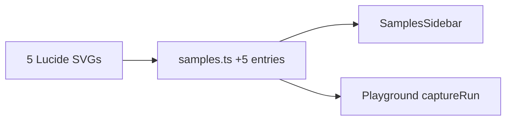

# Add 5 Advanced Sample Programs

## Gap analysis

14 samples exist in [`website/src/data/samples.ts`](website/src/data/samples.ts). Advanced features **already covered**:

- `vibeCheck` / switch (`mood-switch`)
- try/catch (`caught-in-4k`)
- basic classes (`squad-goals`)
- async/await (`hold-up-vibes`)

Advanced features **not yet in the sidebar** (from [`src/keywords.ts`](src/keywords.ts) and [`examples/showcase.gz`](examples/showcase.gz)):

| Feature | Slang keywords |
|---------|----------------|
| Class inheritance | `extends`, `og` |
| Loop continue | `keepCookin` |
| Null + coalescing | `ghosted`, `??` |
| typeof + switch | `whatIsThis`, `vibeCheck` |
| do-while loop | `firstOff`, `stillCookin` |

## 5 new samples

Append to `SAMPLES` in [`website/src/data/samples.ts`](website/src/data/samples.ts) after the existing 14.

| # | ID | Label | Lucide icon | File | Feature |
|---|-----|-------|-------------|------|---------|
| 1 | `dev-squad` | Dev squad | `git-branch` | `git-branch.svg` | `extends`, `og`, method override |
| 2 | `skip-the-mid` | Skip the mid | `skip-forward` | `skip-forward.svg` | `keepCookin` in `for...of` |
| 3 | `ghosted-fr` | Ghosted fr | `ghost` | `ghost.svg` | `ghosted`, `??` null coalescing |
| 4 | `what-is-this` | What is this? | `scan-search` | `scan-search.svg` | `whatIsThis` + `vibeCheck` |
| 5 | `run-it-back` | Run it back | `repeat` | `repeat.svg` | `firstOff` / do-while |

### Source sketches

**dev-squad** — inheritance (adapted from showcase):
```gz
squad Person {
    constructor(name) { me.name = name }
    intro() { bet "its giving " + me.name }
}
squad Dev extends Person {
    constructor(name, lang) {
        og(name)
        me.lang = lang
    }
    intro() { bet og.intro() + " who codes " + me.lang }
}
lockedIn dev = spawn Dev("Nimesh", "gz")
spill(dev.intro())
```
Expected output: `its giving Nimesh who codes gz`

**skip-the-mid** — continue:
```gz
lockedIn vibes = ["fire", "mid", "chill"]
grind (lockedIn vibe of vibes) {
    lowkey (vibe === "mid") { keepCookin }
    spill("vibe check: " + vibe)
}
```
Expected output: `vibe check: fire` then `vibe check: chill`

**ghosted-fr** — null handling:
```gz
cook reply = ghosted
spill(reply ?? "they ghosted us")
cook msg = "yo"
spill(msg ?? "they ghosted us")
```
Expected output: `they ghosted us` then `yo`

**what-is-this** — typeof switch:
```gz
lockedIn score = 42
vibeCheck (whatIsThis score) {
    itsGiving "number":
        spill("its a number fr")
        imOut
    fr:
        spill("idk what that is")
}
```
Expected output: `its a number fr`

**run-it-back** — do-while:
```gz
cook n = 0
firstOff {
    spill("rep " + n)
    n = n + 1
} stillCookin (n < 3)
```
Expected output: `rep 0`, `rep 1`, `rep 2`

All 5 are synchronous — no Playground runner changes needed ([`Playground.tsx`](website/src/components/Playground/Playground.tsx) already supports async via `AsyncFunction`).

## Lucide icons

Add 5 new SVGs to [`website/assets/icons/`](website/assets/icons/), matching the existing pattern (20×20, `stroke="#D4D4D4"`, `stroke-width="2"`), sourced from [lucide.dev](https://lucide.dev/icons/).

## Code changes

### 1. [`website/src/data/samples.ts`](website/src/data/samples.ts)

- Import 5 new icon SVGs
- Append 5 entries to `SAMPLES` (19 total)

### 2. No other file changes

- `SamplesSidebar` — unchanged (reads from `SAMPLES`)
- `Playground` — unchanged
- CSS — unchanged

## Verification

1. Run transpile + eval for all 5 new samples (same as existing verification script)
2. Run `npm run build` in `website/`
3. Confirm expected Receipts output for each sample via Run Code


