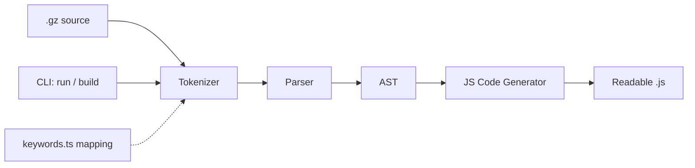

# Build gzlang Transpiler with npm Packaging

Greenfield build based on [gzlang-project.md](gzlang-project.md). TypeScript implementation, full compiler pipeline for a JS subset, manual publish to npm as `gzlang` (name verified available).

## Architecture

## Project structure

- `src/keywords.ts` — single slang-to-JS keyword mapping (all 30+ keywords from the spec, including `spill` → `console.log`). Adding a keyword only touches this file, per the extensibility goal.
- `src/tokenizer/` — hand-written lexer: identifiers/keywords, numbers, strings (single, double, template literals), operators, punctuation, comments; every token carries line/column for error messages.
- `src/parser/` — AST node definitions plus a recursive-descent parser with full operator precedence.
- `src/codegen/` — walks the AST and emits readable, indented JavaScript.
- `src/errors.ts` — friendly syntax errors with line/column and source excerpt.
- `src/index.ts` — public API: `transpile(source: string): string`.
- `src/cli.ts` — `gzlang run app.gz` (transpile to temp + execute with Node) and `gzlang build app.gz [-o out.js]`, plus `--help`/`--version`. No CLI framework needed; hand-rolled arg parsing.
- `examples/` — sample `.gz` programs (hello world, fizzbuzz-style loop, classes, async).
- `tests/` — Vitest unit tests for tokenizer/parser/codegen and end-to-end fixture tests (`.gz` in, expected JS out, plus executing the output).

## Supported language subset

JavaScript semantics with slang keywords, covering everything in the spec's keyword table:

- Declarations: `cook`/`lockedIn`/`legacy` (let/const/var), destructuring left out of v1
- Functions: `chef`, `bet` (return), arrow functions, `waitForIt`/`holdUp` (async/await)
- Control flow: `lowkey`/`deadass` (if/else), `vibeCheck`/`itsGiving`/`fr` (switch), `grind` (for, incl. for-of/for-in), `stillCookin` (while), `firstOff` (do-while), `imOut`/`keepCookin`
- Classes: `squad`, `spawn` (new), `me` (this), `og` (super), methods, extends
- Errors: `yolo`/`caughtIn4K`/`crashOut` (try/catch/throw), finally
- Modules: `yoink`/`putOn` (import/export)
- Literals/operators: `noCap`/`cap`/`ghosted`/`idk`, `whatIsThis` (typeof), `yeet` (delete), all standard JS operators, arrays, objects, template literals

## npm packaging (manual publish)

- `package.json`: name `gzlang`, `bin: { "gzlang": "dist/cli.js" }`, `main`/`types`/`exports` for programmatic use, `files: ["dist"]`, `prepublishOnly: npm run build && npm test`, MIT license, keywords for discoverability.
- Build with `tsup` (fast, bundles to `dist/` with type declarations, adds the CLI shebang).
- `README.md` with install (`npm i -g gzlang`), usage, full keyword table, and examples — this becomes the npm page.
- Verify the publish artifact locally with `npm pack` and a global install smoke test; actual `npm publish` is left to you.

## Out of scope for v1

VS Code extension, formatter, playground, source maps, destructuring/generators/labels (can be added later; parser is structured to extend).