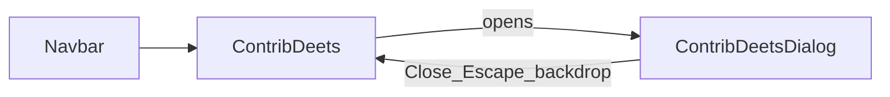

# Contrib Deets dialog

Implement the Figma modal ([node 14:830](https://www.figma.com/design/LHnLgup8b6hqAdMA11ErLP/gzlang?node-id=14-830)) on top of the existing playground shell. Intro animation rules in [docs/animation-rules.md](docs/animation-rules.md) apply to the landing→app morph only; this dialog only needs a short Motion enter/exit so open/close feels consistent with the rest of the site.

## Behavior

1. Remove the chevron from [ContribDeets.tsx](website/src/components/ContribDeets/ContribDeets.tsx).
2. Change the control from an `<a>` (GitHub search link) to a `<button>` that opens the dialog.
3. Open: centered modal over a dimmed, blurred backdrop (`rgba(0,0,0,0.6)` + `backdrop-filter: blur(4px)`).
4. Close: **Close** button dismisses the dialog. Also close on Escape and backdrop click (standard modal UX; keeps the Close path as the primary designed action).
5. Social links open in a new tab:
   - LinkedIn → https://www.linkedin.com/in/nimeshm-work/
   - Github → https://github.com/nimeshm05
6. Icons from existing assets: [linkedin.svg](website/assets/icons/linkedin.svg), [github.svg](website/assets/icons/github.svg).

## UI (match Figma card)

Modal container (~340px, white, `border-radius: 8px`, light border):

- Header: “Contrib Deets” (Geist Mono semibold 16px) + bottom border
- Body: “Developed by OG Nimesh.” then LinkedIn / Github rows (20px icon + 14px label, gap 8px)
- Footer: full-width secondary **Close** button (neutral-100 background, black label)

Reuse CSS variables from [tokens.css](website/src/styles/tokens.css) (`--color-neutral-100`, `--color-neutral-700`, `--font-mono`, `--radius-panel`, etc.). Plain CSS files only — no Tailwind.

## Code structure

- Update [ContribDeets.tsx](website/src/components/ContribDeets/ContribDeets.tsx) / [ContribDeets.css](website/src/components/ContribDeets/ContribDeets.css): button trigger, local `open` state, keep existing reveal motion (`REVEAL_DELAYS.contrib`).
- Add `website/src/components/ContribDeetsDialog/ContribDeetsDialog.tsx` + `.css`: portal (or fixed overlay at app root z-index above navbar), `AnimatePresence` + `motion` for overlay fade and panel opacity/scale with `PREMIUM_EASE` (~200–250ms). Focus trap is not required for v1; set `role="dialog"`, `aria-modal`, labelled by title.
- Extend [Button](website/src/components/Button/Button.tsx) with a `variant?: "primary" | "secondary"` so Close can reuse the secondary style from Figma without a one-off button. Secondary: `background: var(--color-neutral-100)`, `color: var(--color-ink)`, full-width via class on the dialog close button.

## Out of scope

- Changing playground / samples behind the overlay
- Updating intro animation timings in animation-rules.md
- Adding a GitHub icon back into the navbar trigger (Figma trigger is text-only after chevron removal)