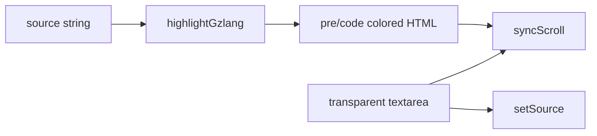

# Playground syntax highlighting

## Goal

Color gzlang code in the playground editor like VS Code: slang keywords, builtins, strings, numbers, and comments each get a distinct color while preserving the current line-number alignment, scroll behavior, and viewport-locked layout.

## Current state

- Editor is a plain `<textarea>` in [`Playground.tsx`](website/src/components/Playground/Playground.tsx)
- Typography is controlled by shared tokens (`--editor-line-height`, `--editor-padding`, `--font-mono`)
- Keyword source of truth lives in [`src/keywords.ts`](src/keywords.ts) and is exported from `gzlang` as `KEYWORDS` and `BUILTINS`

## Approach: highlight overlay (no heavy editor dependency)

Replace the textarea with a small `CodeEditor` component using the standard **textarea + mirrored `<pre>`** pattern:



- User types in a transparent textarea (`caret-color` stays visible)
- A `<pre><code>` layer behind it renders colored HTML
- Both share identical font, padding, line-height, and `white-space: pre-wrap`
- Scroll position is synced on scroll so line numbers stay aligned

This avoids adding CodeMirror/Monaco and keeps plain CSS control.

## Highlighting logic

Add [`website/src/lib/highlightGzlang.ts`](website/src/lib/highlightGzlang.ts):

- Import `KEYWORDS` and `BUILTINS` from `gzlang`
- Export `PASSTHROUGH_KEYWORDS` from [`src/index.ts`](src/index.ts) so the highlighter stays in sync with the compiler (6 words: `extends`, `finally`, `instanceof`, `in`, `of`, `void`)
- Build a **fault-tolerant regex highlighter** (do not call `tokenize()` — it throws on partial/invalid input while the user is typing)
- Tokenize in safe order:
  1. Block comments `/* ... */`
  2. Line comments `// ...`
  3. Strings (`"..."`, `'...'`, `` `...` `` with basic escape handling)
  4. Numbers
  5. Gzlang keywords (`Object.keys(KEYWORDS)` + passthrough set)
  6. Builtins (`spill`, etc.)
- Escape HTML in all non-highlighted text
- Return HTML string with semantic spans: `<span class="token-keyword">`, `token-string`, `token-comment`, `token-number`, `token-builtin`

## VS Code-inspired colors (light theme)

Extend [`website/src/styles/tokens.css`](website/src/styles/tokens.css):

| Token | CSS variable | Color |
|-------|--------------|-------|
| Keyword | `--syntax-keyword` | `#0000ff` |
| String | `--syntax-string` | `#a31515` |
| Comment | `--syntax-comment` | `#008000` |
| Number | `--syntax-number` | `#098658` |
| Builtin | `--syntax-builtin` | `#795e26` |
| Default code | `--syntax-default` | `#404040` (existing neutral-700) |

Add rules in [`website/src/components/CodeEditor/CodeEditor.css`](website/src/components/CodeEditor/CodeEditor.css) mapping span classes to these tokens.

## Component changes

### New `CodeEditor`

[`website/src/components/CodeEditor/CodeEditor.tsx`](website/src/components/CodeEditor/CodeEditor.tsx) + CSS:

- Props: `value`, `onChange`, `lineCount`, `placeholder`, `aria-label`
- Reuse existing editor dimension logic (`rows`, height calc from line count)
- Placeholder shown only on the highlight layer when `value` is empty
- `useMemo` for `highlightGzlang(value)`

### Update `Playground`

In [`Playground.tsx`](website/src/components/Playground/Playground.tsx):

- Swap `<textarea>` for `<CodeEditor>`
- Move editor-specific styles from [`Playground.css`](website/src/components/Playground/Playground.css) into `CodeEditor.css` (`.playground-input` becomes `.code-editor-input`, etc.)
- Keep gutter + scroll container unchanged

## Package touch

One-line export addition in [`src/index.ts`](src/index.ts):

```ts
export { KEYWORDS, BUILTINS, PASSTHROUGH_KEYWORDS } from "./keywords.js";
```

Rebuild root `gzlang` dist before website build (`file:..` dependency).

## Verification

- Empty editor: placeholder still visible, no line numbers beyond content
- Sample load: keywords (`chef`, `lowkey`, `spill`, etc.) colored blue/green/brown appropriately
- Typing new lines: gutter + highlight stay aligned
- Invalid partial code: highlighting still works (no crash)
- `npm run build` in `website/` passes

## Out of scope

- Full LSP / error squiggles
- Dark theme toggle
- Highlighting in console output
