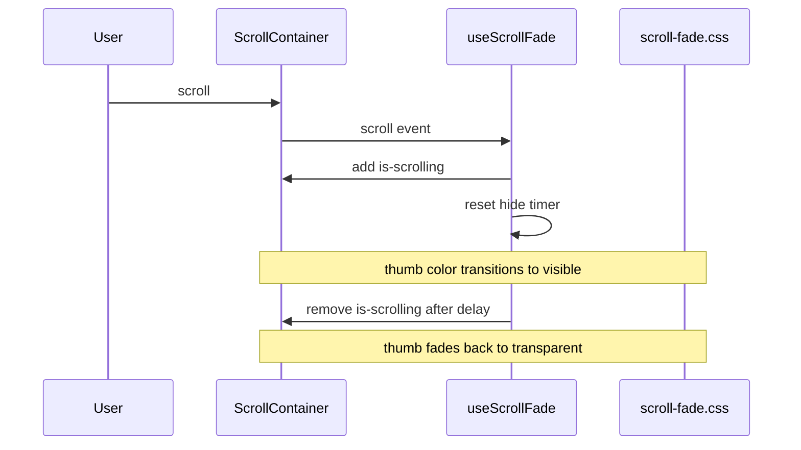

# Fade-out idle scrollbars in playground

## Goal

Apply macOS-style **scroll-only** scrollbar visibility to every playground scroll container:

- [`.samples-list`](website/src/components/SamplesSidebar/SamplesSidebar.css) — samples sidebar
- [`.playground-editor`](website/src/components/Playground/Playground.css) — code editor + gutter
- [`.playground-console-output`](website/src/components/Playground/Playground.css) — console output

Default state: scrollbar thumb at **opacity 0** (via `transparent` color). While scrolling: thumb fades to full visibility. After scroll stops (~800ms): fades back to hidden.

## Approach

Use a small shared hook + a single CSS utility class. Pure CSS cannot detect “currently scrolling,” so a lightweight `scroll` listener toggles an `is-scrolling` class.



## Files to add / change

### 1. Design tokens — [`website/src/styles/tokens.css`](website/src/styles/tokens.css)

Add reusable scrollbar tokens (aligned with existing token style and the thin styling already drafted on `feature/advanced-samples-and-scrollbar-polish`):

- `--scrollbar-size: 6px`
- `--scrollbar-thumb: var(--color-neutral-300)`
- `--scrollbar-fade-duration: 300ms`
- `--scrollbar-hide-delay: 800ms` (documented for JS; value used by hook default)

### 2. Shared scrollbar styles — new [`website/src/styles/scroll-fade.css`](website/src/styles/scroll-fade.css)

Define `.scroll-fade` base styles:

- **Firefox:** `scrollbar-width: thin`; default `scrollbar-color: transparent transparent`; visible when `.scroll-fade.is-scrolling`
- **WebKit:** `::-webkit-scrollbar` width from token; thumb starts `transparent` with `transition: background-color var(--scrollbar-fade-duration)`
- **Visible state:** `.scroll-fade.is-scrolling` sets thumb to `var(--scrollbar-thumb)`

Import in [`website/src/styles/global.css`](website/src/styles/global.css) so the utility is available app-wide without duplicating per-component rules.

### 3. Hook — new [`website/src/hooks/useScrollFade.ts`](website/src/hooks/useScrollFade.ts)

```ts
// Returns a ref to attach to any scroll container
export function useScrollFade<T extends HTMLElement>(
  hideDelayMs = 800,
): RefObject<T | null>
```

Behavior:

- On `scroll`: add `is-scrolling`, debounce removal with `setTimeout`
- Use `{ passive: true }` listener
- Clean up listener + timer on unmount
- No hover/focus triggers (per your choice)

### 4. Wire up components

**[`SamplesSidebar.tsx`](website/src/components/SamplesSidebar/SamplesSidebar.tsx)**

- Call `useScrollFade<HTMLUListElement>()`
- Attach ref + `scroll-fade` class to the `motion.ul.samples-list`

**[`Playground.tsx`](website/src/components/Playground/Playground.tsx)**

- Two hook instances: one for `.playground-editor`, one for `.playground-console-output`
- Attach refs + `scroll-fade` class to those elements

### 5. Remove per-component scrollbar duplication

Do **not** copy the inline `::-webkit-scrollbar` blocks from `feature/advanced-samples-and-scrollbar-polish` into individual CSS files. The shared `.scroll-fade` utility replaces that approach and keeps styling consistent across all three containers.

No changes needed to [`CodeEditor.tsx`](website/src/components/CodeEditor/CodeEditor.tsx) — scrolling is handled by the parent `.playground-editor` wrapper.

## Behavior details

| State | Scrollbar appearance |
|---|---|
| Idle | Thumb transparent (invisible) |
| Active scroll | Thumb visible (`--color-neutral-300`) |
| Scroll stopped | Fade out after ~800ms |

Transition timing: ~300ms ease on thumb color (WebKit); Firefox will snap between transparent/visible (acceptable limitation).

## Out of scope

- Hover/focus-based visibility
- Mobile `.playground-shell` layout scroll (only the three named areas)
- Site-wide/global scroll containers outside playground

## Verification

Manual checks in the playground:

1. Samples list — scroll with trackpad/mouse wheel; thumb appears during scroll, disappears ~1s after stop
2. Code editor — same behavior when content exceeds viewport height
3. Console output — run a sample that produces multi-line output, expand Receipts, repeat scroll test
4. Confirm no scrollbar flash on initial page load when content is not scrollable
5. Quick sanity check in Chrome/Safari (WebKit) and Firefox
