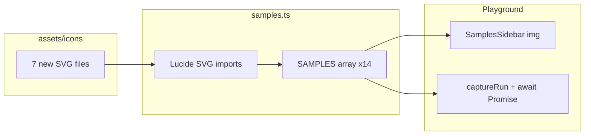

# Add 7 Gen Z Sample Programs + Lucide Icons

## Current state

- Samples live in [`website/src/data/samples.ts`](website/src/data/samples.ts) — 7 hardcoded entries with inline gzlang source + Vite SVG imports.
- Icons are static Lucide-style SVGs in [`website/assets/icons/`](website/assets/icons/) (20×20, `fill="#D4D4D4"`).
- Sidebar renders icons via `` in [`website/src/components/SamplesSidebar/SamplesSidebar.tsx`](website/src/components/SamplesSidebar/SamplesSidebar.tsx).
- Playground runs code synchronously via `new Function(js)` in [`website/src/components/Playground/Playground.tsx`](website/src/components/Playground/Playground.tsx) — **async samples will not show output unless the runner is updated**.

## New samples (7)

Mixed complexity: 3 beginner, 2 intermediate, 2 advanced. Each maps to a Lucide icon saved as a new SVG in `assets/icons/`.

| # | ID | Label | Lucide icon | File | Feature focus |
|---|-----|-------|-------------|------|---------------|
| 1 | `yo-bestie` | Yo bestie | `message-circle` | `message-circle.svg` | `chef`, `cook`, `spill` — hello-world greet |
| 2 | `fizzbuzz-fr` | Fizzbuzz fr | `flame` | `flame.svg` | `grind`, nested `lowkey`/`deadass` — classic fizzbuzz (1–15) |
| 3 | `main-character` | Main character check | `crown` | `crown.svg` | arrays, `.includes()`, conditionals |
| 4 | `mood-switch` | Mood vibe switch | `toggle-left` | `toggle-left.svg` | `vibeCheck` / `itsGiving` / `fr` / `imOut` |
| 5 | `caught-in-4k` | Caught in 4K | `camera` | `camera.svg` | `yolo` / `caughtIn4K` / `crashOut` |
| 6 | `squad-goals` | Squad goals | `users` | `users.svg` | `squad`, `spawn`, `me`, `og`, `extends` |
| 7 | `hold-up-vibes` | Hold up vibes | `timer` | `timer.svg` | `waitForIt`, `holdUp`, Promise + setTimeout |

### Example source sketches

**yo-bestie** (beginner):
```gz
chef greet(name) {
    spill("yo " + name)
}
cook bestie = "fam"
greet(bestie)
```

**fizzbuzz-fr** (beginner — adapted from [`examples/fizzbuzz.gz`](examples/fizzbuzz.gz)):
```gz
grind (cook i = 1; i <= 15; i++) {
    lowkey (i % 15 === 0) { spill("fizzbuzz") }
    deadass lowkey (i % 3 === 0) { spill("fizz") }
    deadass lowkey (i % 5 === 0) { spill("buzz") }
    deadass { spill(i) }
}
```

**main-character** (beginner):
```gz
lockedIn roster = ["main character", "npc", "side quest"]
cook name = "main character"
lowkey (roster.includes(name)) {
    spill("main character energy detected")
} deadass {
    spill("npc behavior")
}
```

**mood-switch** (intermediate):
```gz
lockedIn mood = "fire"
vibeCheck (mood) {
    itsGiving "fire":
        spill("its giving heat")
        imOut
    itsGiving "mid":
        spill("mid vibes only")
        imOut
    fr:
        spill("unknown mood")
}
```

**caught-in-4k** (intermediate):
```gz
yolo {
    crashOut spawn Error("you were caught in 4k")
} caughtIn4K (err) {
    spill("caught in 4k: " + err.message)
}
```

**squad-goals** (advanced — simplified from [`examples/showcase.gz`](examples/showcase.gz)):
```gz
squad Bestie {
    constructor(name) { me.name = name }
    intro() { bet "its giving " + me.name }
}
lockedIn homie = spawn Bestie("fam")
spill(homie.intro())
```

**hold-up-vibes** (advanced — adapted from [`examples/async.gz`](examples/async.gz)):
```gz
waitForIt chef fetchVibe(ms) {
    holdUp spawn Promise((resolve) => setTimeout(() => resolve("vibes received"), ms))
}
waitForIt chef main() {
    lockedIn vibe = holdUp fetchVibe(10)
    spill(vibe)
}
holdUp main()
```

Each sample will be manually verified with **Run Code** before finishing.

## Lucide icons — export to `assets/icons/`

For each of the 7 new icons:

1. Source the icon from [Lucide](https://lucide.dev/icons/) (same names as above).
2. Save to [`website/assets/icons/<name>.svg`](website/assets/icons/).
3. Normalize to match existing icons (e.g. [`calculator.svg`](website/assets/icons/calculator.svg)):
   - `width="20" height="20" viewBox="0 0 24 24"` (or 20×20 if path scales cleanly)
   - Color: `fill="#D4D4D4"` (or `stroke="#D4D4D4"` with `stroke-width="2"` if the Lucide icon is stroke-only — visually tune to match the filled set)
   - Remove unnecessary Lucide metadata attributes

Existing sample icons (`calculator`, `list-todo`, `hat-glasses`, `sparkles`, `clover`, `handshake`, `hourglass`) stay as-is — no migration needed.

## Code changes

### 1. [`website/src/data/samples.ts`](website/src/data/samples.ts)

- Import 7 new SVG assets.
- Append 7 entries to `SAMPLES` (14 total).
- Order: keep existing 7 first, then new 7 in the table order above.

### 2. [`website/src/components/Playground/Playground.tsx`](website/src/components/Playground/Playground.tsx) — async runner fix

The `hold-up-vibes` sample calls `holdUp main()` which returns a Promise. Update `captureRun` to await promise results:

```typescript
const result = runner();
if (result instanceof Promise) {
  await result;
}
```

- Make `captureRun` async and `handleRun` await it (minimal change; no UI loading state needed for a 10ms delay).

### 3. No changes needed to

- `SamplesSidebar.tsx` / CSS — existing `` pattern works unchanged.
- `package.json` — no new dependencies (static SVGs only).

## Verification

1. Run `npm run build` in `website/`.
2. Manually click each of the 14 samples and hit **Run Code**; confirm expected Receipts output.
3. Pay special attention to `hold-up-vibes` (async) and `squad-goals` (classes) for runtime errors.


