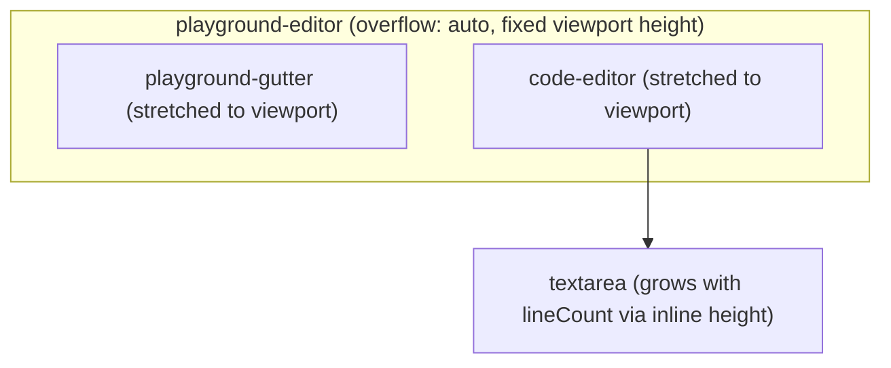
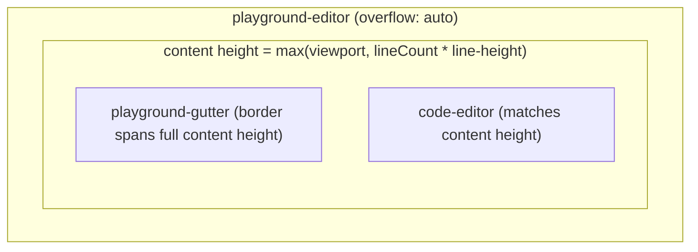

# Extend line-number gutter border with content

## Problem

The line-number column (`.playground-gutter`) in [`Playground.tsx`](website/src/components/Playground/Playground.tsx) renders a right border that visually separates the gutter from the code editor. That border currently stops at the **visible editor viewport height** instead of extending through all line numbers when content grows.

## Root cause

The editor scroll container uses flexbox with stretch alignment:

```53:58:website/src/components/Playground/Playground.css
.playground-editor {
  display: flex;
  flex: 1 1 auto;
  align-items: stretch;
  min-height: 0;
}
```

Layout today:



With `align-items: stretch` on a scroll container that has a **definite height**, both flex children are clamped to the scrollport height. The textarea inside `.code-editor` grows taller (`overflow: hidden`), but the gutter box — and its `border-right` — stays viewport-tall. Line numbers may paint beyond that box, but the border does not follow.

## Fix (CSS-only, minimal)

Update [`Playground.css`](website/src/components/Playground/Playground.css):

1. **Change** `.playground-editor` from `align-items: stretch` to `align-items: flex-start`
   - Flex children now size to their content, so the scroll container's `scrollHeight` grows with the editor and gutter scroll together.

2. **Add** `min-height: 100%` to `.playground-gutter`
   - Mirrors existing `.code-editor { min-height: 100% }` in [`CodeEditor.css`](website/src/components/CodeEditor/CodeEditor.css)
   - Keeps the border filling the full editor area when there are only a few lines (short content case)

Expected layout after fix:



## Files to change

| File | Change |
|------|--------|
| [`website/src/components/Playground/Playground.css`](website/src/components/Playground/Playground.css) | `align-items: flex-start` on `.playground-editor`; `min-height: 100%` on `.playground-gutter` |

No TSX changes required — gutter line count and textarea height already use the same tokens (`--editor-line-height`, `--editor-padding`).

## Verification

1. Open the playground with 1–2 lines — gutter border should still run the full editor height (not stop early).
2. Paste a sample with 30+ lines — border should extend through all lines while scrolling.
3. Scroll the editor — gutter, border, line numbers, and code should move together (same scroll container, no sync code needed).
4. Run `npm run build` in `website/`.

## Out of scope

- Changing scroll behavior, syntax highlighting, or line-number rendering logic
- Adding a wrapper element (only needed if heights ever drift; the shared tokens should keep gutter and editor aligned)
