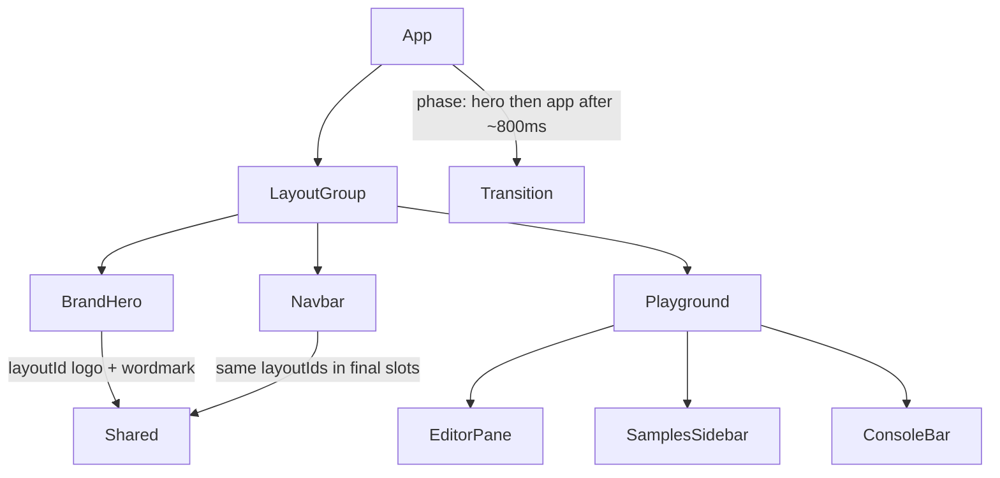

# Playground Screen + Shared Layout Transition

## Goal

Morph the current centered brand landing into the Figma **Code Playground** screen (`1:17`) so the mascot and wordmark physically travel into the navbar — no fade/replace — then stagger-reveal the app UI per `[docs/animation-rules.md](docs/animation-rules.md)`.

## End-state UI (from Figma)

Desktop shell matching the design:

- **Navbar** (100px): Faster One `gzlang` left · 100px mascot center · GitHub icon + “Contrib Deets” + chevron right
- **Playground panel** (rounded 8px, `#e5e5e5` border): editor (line gutter + textarea) · header “Code Playground” + lime **Run Code** · bottom **Console** bar with chevron
- **Right sidebar** (400px): Samples / Documentation tabs · sample list (Aura Calculator, W or L checker, Is this cap?, Rizz calculator, Touch grass reminder, Vibe check, Sigma countdown)

Tokens from Figma → extend `[website/src/styles/tokens.css](website/src/styles/tokens.css)`:

- `--color-surface` / `--color-ink` (existing)
- `--color-neutral-100` `#f5f5f5` … `--color-neutral-700` `#404040`
- `--color-accent` `#a5fd15` (`Cyan/cyan-600`), `--color-accent-ink` `#233800`
- `--font-mono`: `"Geist Mono", ui-monospace, monospace`
- Navbar/mascot sizes: `--size-nav-mascot: 100px`, `--font-size-nav-wordmark: 24px`, `--space-page-x: clamp(1rem, 5vw, 7.5rem)` (120px desktop)

Load **Geist Mono** (+ keep Faster One) in `[website/index.html](website/index.html)`.

## Dependencies

In `[website/package.json](website/package.json)`:

- `motion` (Motion.dev — `layoutId`, `motion.*`, variants)
- `gzlang`: `file:..` so **Run Code** can call browser-safe `transpile()` from `[src/index.ts](src/index.ts)`

## Architecture




Orchestration in `[website/src/App.tsx](website/src/App.tsx)`:

1. `phase: "hero" | "app"`; after ~800ms (or mascot `onLoad` + 800ms), set `"app"`.
2. Wrap in `LayoutGroup`.
3. **Hero**: only centered logo + wordmark (`layoutId="logo"` / `layoutId="wordmark"`). Navbar shell mounted but invisible (`visibility`/`opacity` 0, still taking layout so final slots exist when phase flips — or mount destination nodes when phase becomes `app` and let Motion FLIP; prefer single shared elements remounted into navbar slots).
4. **App**: same two shared elements live in navbar; playground + sidebar + run + contrib reveal with staggered delays.

Refactor `[BrandHero](website/src/components/BrandHero/BrandHero.tsx)`: remove CSS enter keyframes (they conflict with shared layout). Use `motion` elements + `image-rendering: pixelated` on the mascot.

## Shared layout transition (canonical timing)

Ease everywhere for shared moves: `[0.22, 1, 0.36, 1]`. No springs.

After hero hold (~800ms), animation clock `t=0`:


| t       | Action                                                                                             |
| ------- | -------------------------------------------------------------------------------------------------- |
| 0–100ms | Hold / settle                                                                                      |
| 100ms   | Logo + wordmark start shared layout move (duration **650ms**); logo `z-index: 100` while traveling |
| 250ms   | Playground container: opacity 0→1, `y` 24→0, blur 8→0, **500ms**, easeOutCubic                     |
| 350ms   | Samples sidebar: opacity 0→1, `x` 12→0, **350ms**                                                  |
| 450ms   | Run button: scale 0.94→1, opacity 0→1, **250ms**                                                   |
| 550ms   | Contrib Deets (+ GitHub): opacity 0→1, `y` -8→0, scale 0.98→1, **300ms**                           |
| ~800ms  | Complete; logo drops to normal navbar stacking                                                     |


Wordmark flies to top-left; logo shrinks to navbar center. Prefer Motion `layoutId` over manual FLIP math.

Respect `prefers-reduced-motion`: skip shared travel; jump to final app layout.

## Component breakdown (plain CSS, no Tailwind)

```
website/src/components/
  BrandHero/          # hero-only composition (shared motion children)
  Navbar/
  Playground/
  SamplesSidebar/
  Button/
  Dropdown/
  icons/              # committed Figma MCP exports (not hand-drawn paths)
website/src/data/samples.ts
website/src/hooks/useIntroTransition.ts
website/assets/icons/*.svg
```

- **Navbar**: 3-column flex (wordmark | mascot | actions), `padding-inline` from `--space-page-x`.
- **Playground**: bordered shell; editor with line numbers synced to textarea lines; placeholder “Type your code here”.
- **SamplesSidebar**: tab state Samples | Documentation; Samples = list from `samples.ts`; Documentation = simple empty/placeholder panel.
- **Button**: on click → `transpile(source)` → `eval` in try/catch with console capture → Console panel text. Errors via `GzSyntaxError` message.
- **Dropdown**: link outward (GitHub icon + label); no dropdown behavior in this pass unless trivial.

Download and commit all Figma icon assets from `get_design_context` URLs into `website/assets/icons/` (calculator, list, cap, sparkles, plant, handshake, hourglass, chevrons, GitHub/minimised). Reuse existing `[website/assets/gzlang-mascot.svg](website/assets/gzlang-mascot.svg)` for logo.

Hardcode short `.gz` snippets in `samples.ts` for each list row (Gen Z-flavored demos); selecting a row fills the editor.

## Responsive

Match Figma at desktop. Below ~960px: sidebar stacks under editor (or becomes full-width below); navbar padding and mascot scale down via tokens/`clamp`. Keep one composition; no card clutter.

## Out of scope

- Full documentation content / real Contrib dropdown
- Deploy/hosting
- Changing the root transpiler package beyond being a `file:` dependency of the website

