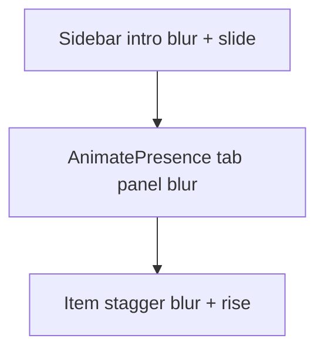

# Sidebar blur animations

## Goal

Add a subtle **`blur(4px) → blur(0px)`** effect to all sidebar motion in [`SamplesSidebar.tsx`](website/src/components/SamplesSidebar/SamplesSidebar.tsx), covering:

1. Sidebar intro reveal (page load)
2. Staggered item entrance (Cookbooks list + Documentation sections)
3. Tab switch crossfade (Cookbooks ↔ Documentation)

Matches the playground-main blur pattern in [`Playground.tsx`](website/src/components/Playground/Playground.tsx) but at **4px** instead of 8px.

## Current animation touchpoints

| Location | Current motion | File |
|---|---|---|
| Sidebar shell | `opacity + x: 12` slide-in | `SamplesSidebar.tsx` |
| Cookbooks items | `opacity + y: 60` spring stagger | `SIDEBAR_ITEM_VARIANTS` in `motion.ts` |
| Documentation sections | same stagger variants | `DocumentationPanel.tsx` |
| Tab switch | instant unmount/mount (no transition) | `SamplesSidebar.tsx` |

## Approach

Centralize blur values and panel transition tokens in [`motion.ts`](website/src/motion.ts), then wire them into the three animation layers.



### 1. Shared motion tokens — [`motion.ts`](website/src/motion.ts)

Add:

```ts
export const SIDEBAR_BLUR = "4px";

export const SIDEBAR_TAB_PANEL_TRANSITION = {
  duration: 0.25,
  ease: EASE_OUT_CUBIC,
};

export const SIDEBAR_TAB_PANEL_VARIANTS = {
  hidden: { opacity: 0, filter: `blur(${SIDEBAR_BLUR})` },
  show: { opacity: 1, filter: "blur(0px)" },
  exit: { opacity: 0, filter: `blur(${SIDEBAR_BLUR})` },
};
```

Update `SIDEBAR_ITEM_VARIANTS`:

```ts
hidden: { opacity: 0, y: 60, filter: `blur(${SIDEBAR_BLUR})` },
show: {
  opacity: 1,
  y: 0,
  filter: "blur(0px)",
  transition: SIDEBAR_ITEM_SPRING,
},
```

### 2. Sidebar intro blur — [`SamplesSidebar.tsx`](website/src/components/SamplesSidebar/SamplesSidebar.tsx)

Extend the existing `motion.aside` reveal:

```tsx
initial={reveal ? { opacity: 0, x: 12, filter: `blur(${SIDEBAR_BLUR})` } : false}
animate={{ opacity: 1, x: 0, filter: "blur(0px)" }}
```

Same duration/ease as today (`0.35s`, `EASE_OUT_CUBIC`).

### 3. Tab switch blur — [`SamplesSidebar.tsx`](website/src/components/SamplesSidebar/SamplesSidebar.tsx)

Wrap tab panel content in `AnimatePresence mode="wait"` with a keyed `motion.div`:

```tsx
<AnimatePresence mode="wait">
  {tab === "samples" ? (
    <motion.div key="samples" className="samples-sidebar-panel" variants={...} initial="hidden" animate="show" exit="exit" transition={SIDEBAR_TAB_PANEL_TRANSITION}>
      <ScrollArea ... />
    </motion.div>
  ) : (
    <motion.div key="documentation" ...>
      <DocumentationPanel />
    </motion.div>
  )}
</AnimatePresence>
```

Import `AnimatePresence` from `motion/react`.

Add layout wrapper CSS in [`SamplesSidebar.css`](website/src/components/SamplesSidebar/SamplesSidebar.css):

```css
.samples-sidebar-panel {
  display: flex;
  flex: 1 1 auto;
  flex-direction: column;
  min-height: 0;
}
```

This preserves scroll area flex sizing inside the animated wrapper.

### 4. Stagger blur — no component changes needed

[`DocumentationPanel.tsx`](website/src/components/DocumentationPanel/DocumentationPanel.tsx) and the Cookbooks `motion.li` items already consume `SIDEBAR_ITEM_VARIANTS`. Updating the shared variant in `motion.ts` automatically applies blur to both tabs' stagger animations.

## Behavior summary

| Moment | Blur | Other motion |
|---|---|---|
| Page intro | 4px → 0 | slide from `x: 12`, fade in |
| Tab switch | 4px → 0 (enter), 0 → 4px (exit) | fade, `mode="wait"` |
| Item stagger | 4px → 0 per item | rise from `y: 60`, spring |

## Out of scope

- Blur on tab button backgrounds (tabs stay instant)
- Changing playground-main blur (stays 8px)
- Re-introducing sliding/clip-path tab indicators

## Verification

1. Load playground with intro — sidebar blurs in with slide
2. Cookbooks tab — items stagger in with blur clearing per row
3. Switch to Documentation — outgoing panel blurs out, incoming blurs in, sections stagger
4. Switch back to Cookbooks — same tab transition blur
5. `npm run build` in `website/`
