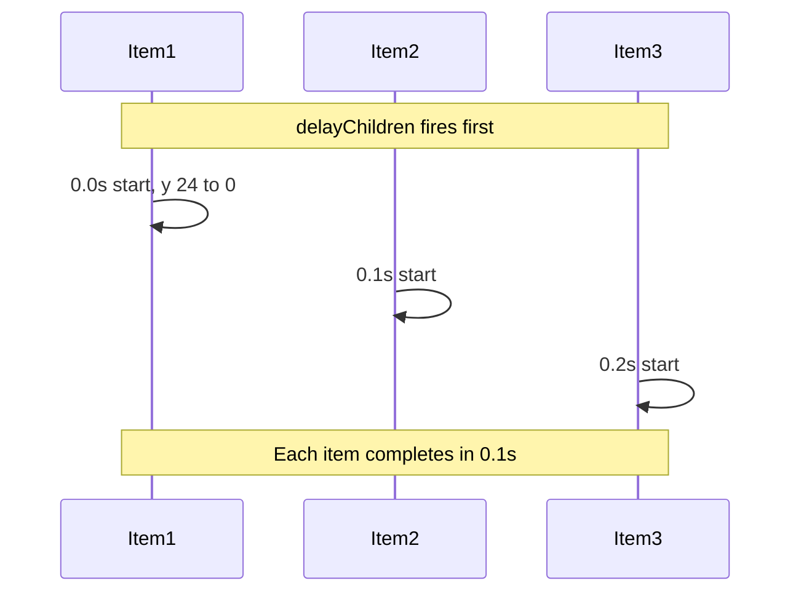

# Update Samples Sidebar Stagger Animation

## What you asked for

This is a **staggered animation** (Motion.dev `staggerChildren`). Each list item starts 24px below its final position, fades in, and enters with a **0.1s delay between items**.

## Current behavior

In [`website/src/components/SamplesSidebar/SamplesSidebar.tsx`](website/src/components/SamplesSidebar/SamplesSidebar.tsx):

```14:34:website/src/components/SamplesSidebar/SamplesSidebar.tsx
const listVariants = {
  hidden: {},
  show: (delayChildren: number) => ({
    transition: {
      staggerChildren: 0.06,
      delayChildren,
    },
  }),
};

const itemVariants = {
  hidden: { opacity: 0, y: 10 },
  show: {
    opacity: 1,
    y: 0,
    transition: {
      duration: 0.3,
      ease: PREMIUM_EASE,
    },
  },
};
```

- Stagger: **60ms** between items
- Travel: **10px** upward
- Duration: **300ms** per item

## Planned changes

Single file change in [`website/src/components/SamplesSidebar/SamplesSidebar.tsx`](website/src/components/SamplesSidebar/SamplesSidebar.tsx):

| Property | Current | New |
|----------|---------|-----|
| `staggerChildren` | `0.06` | `0.1` |
| `hidden.y` | `10` | `24` |
| `show` duration | `0.3` | `0.1` |
| Opacity | `0 → 1` | `0 → 1` (unchanged) |
| Easing | `PREMIUM_EASE` | `PREMIUM_EASE` (unchanged) |

Updated variants:

```tsx
const listVariants = {
  hidden: {},
  show: (delayChildren: number) => ({
    transition: {
      staggerChildren: 0.1,
      delayChildren,
    },
  }),
};

const itemVariants = {
  hidden: { opacity: 0, y: 24 },
  show: {
    opacity: 1,
    y: 0,
    transition: {
      duration: 0.1,
      ease: PREMIUM_EASE,
    },
  },
};
```

Positive `y: 24` in Motion means the item starts **24px below** its resting position and slides up to `y: 0`.

## What stays the same

- Parent `<motion.aside>` slide-in (`opacity` + `x: 12`) — unchanged per [`docs/animation-rules.md`](docs/animation-rules.md) Step 5
- `delayChildren` logic (`REVEAL_DELAYS.sidebar + 0.12` on intro, `0.04` after) — unchanged
- No CSS changes needed — animation is fully driven by Motion variants
- Tab switch behavior — list only animates on initial reveal (same as today)

## Visual timeline (14 items)

With 0.1s stagger + 0.1s duration, items cascade sequentially:



Total list cascade: ~`(n - 1) * 0.1 + 0.1` ≈ **1.4s** for 14 samples after the sidebar's own delay.

## Verification

1. Run `npm run dev` in `website/`
2. Trigger the intro transition (landing → playground)
3. Confirm each sample row slides up 24px with fade, one after another at 0.1s intervals
